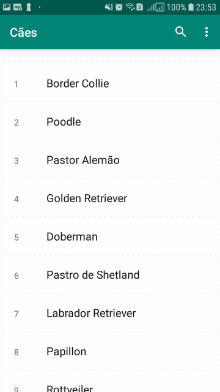

# RecyclerView
Este projeto contém uma library que facilita a implementação do Searchable, RecyclerView e database SQlite 

Step 1. Adicione-o em sua raiz build.gradle no final dos repositórios: 

	allprojects {
		repositories {
			...
			maven { url 'https://jitpack.io' }
		}
	}
Step 2. Adicione as dependências de dependência

	dependencies {
	        implementation 'com.github.maycon1038:Library-Expandable-RecyclerView:2.0'
	}

Step 3. implemente Adapters e o RecyclerViewOnClickListener
   
    public class MainActivity extends AppCompatActivity implements Adapters, RecyclerViewOnClickListener {

   ....
          
	  //carregue sua lista de itens que será exibido no recycleview e osIDs do seu layout customizado
        listID = new ArrayList<>();
        ItensDatabase = new ArrayList<>();
        listID.add(R.id.tv_id);
        ItensDatabase.add("ranking");
        listID.add(R.id.tv_name);
        ItensDatabase.add("raca");
          //carregue sua lista de itens que será exibido no recycleview
       //passe   o id do seu layout customizado,os seus ids e os nomes dos itens a ser exibido
        AdapterUtil.with(this).configRecycleViewAdapter(R.layout.itens, listID, ItensDatabase).
	//passe o seu curso
                setCursor(cursor).start(this);

    }

   Para filtrar dados use
            
	    myAdapter.filterData("string de busca");
        
   trabalhe o seu metodo onclick
       
       @Override
        public void onClickListener(View view, JsonArray json, int position) {
        JsonObject jso = json.get(position).getAsJsonObject();
        caes cao = new caes(jso);
	cao.getName();
	}
   
      
   

  
